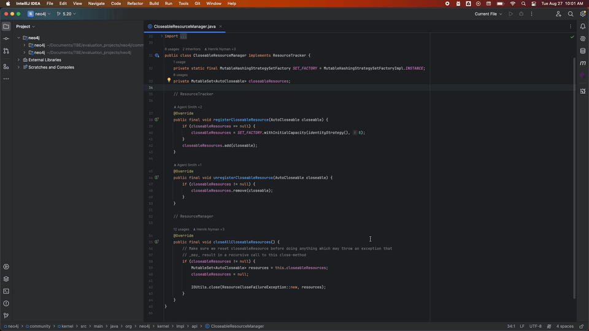
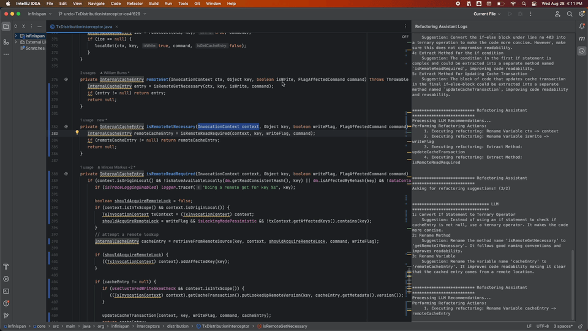
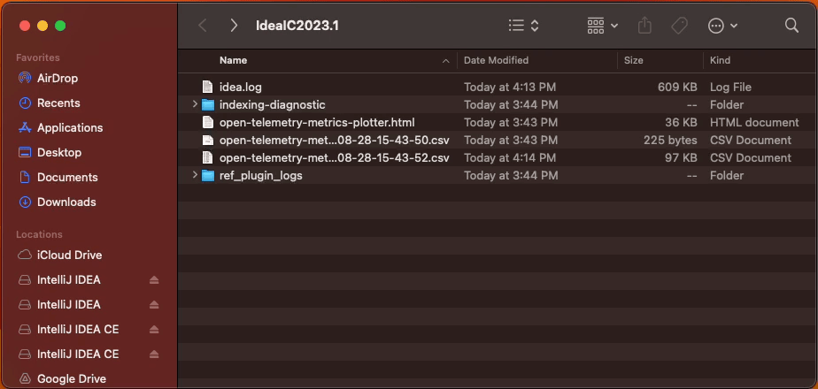

# Refactoring Assistant

<!-- Plugin description -->
Researching collaboration between LLMs and IDEs to suggest various refactoring actions that could be applied to your code. 
This tool leverages the power of LLMs to provide suggestions about what to change, but leverages
the reliability of IntelliJ IDE to carry out correctly the code transformations.
<!-- Plugin description end -->

### Table of contents

- [Installation](#installation)
- [Trigger Refactoring Assistant](#triggering-refactoring-assistant)
- [Telemetry Data](#telemetry-data)

## Installation

- Download Intellij IDEA 2023.1
- Download the plugin from this repository: [refactoring-assistant-plugin.zip](dist%2Frefactoring-assistant-plugin.zip)
- Then, follow the instructions [here](https://www.jetbrains.com/help/idea/managing-plugins.html#install_plugin_from_disk) to “install plugin from disk” in your IDE. Be sure to restart the IDE.
  
- Go to Settings | Tools | Large Language Models and enter your API key in the "API Key" field. Select the appropriate LLM in the dropdown list.
  

## Triggering Refactoring Assistant

- Find a Java class you’d like to improve.
- Right-click on the class name -> Select "Show Context Actions" -> Select "Refactoring Assistant"

[//]: # (   ![trigger_plugin.gif]&#40;readme-images/gifs/v2.gif&#41;)
- If you liked any of the suggestions, select that particular suggestion and execute it by pushing the Refactor button! You can execute as many (or none) of the shown suggestions.
- Hit the ESC button when you’re done, to close the popup window with suggested refactorings.

[//]: # (#### Optional: View the logs of the assistant)

[//]: # ()
[//]: # (-  Click on View | Tool Windows | Refactoring Assistant Logs)

[//]: # (   ![trigger_plugin.gif]&#40;readme-images/gifs/open_logs.gif&#41;)

## Telemetry data

The plugin stores anonymous telemetry data on your local machine. 
It does NOT contain any personal information about you or about the code that you develop. 
Manually sending this telemetry data to us, will help us understand how developers think about the plugin suggestions. 
The recorded information is in a human-readable format, so you can proofread it before sending it to us.

Telemetry data is collected in a file on the local machine of the developer, under the IntelliJ Idea folder
`ref_plugin_logs/ref_telemetry_data.jsonl`. In my case, the full path
is `~/Library/Logs/JetBrains/IntelliJIdea2023.1/ef_plugin_logs/ef_telemetry_data.log`.
The data in stored in *JSONL* format. 
Each line in the telemetry file represents a JSON object, parseable by a json parser. You can use [this](https://pprint-ndjson.neverendingqs.com) online formatter to view the contents of your telemetry data before you send it to us.

### How to find the telemetry data file?

 - Click Help | Show Log in Finder
  
 - Locate the telemetry file under "ref_plugin_logs/ref_telemetry_data.jsonl"
  

